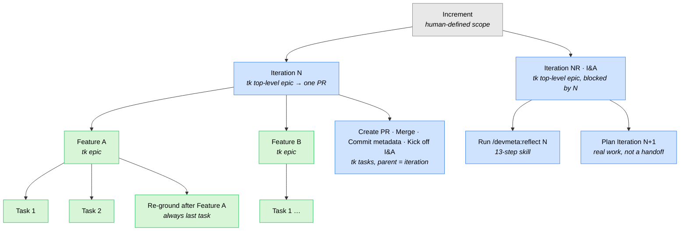
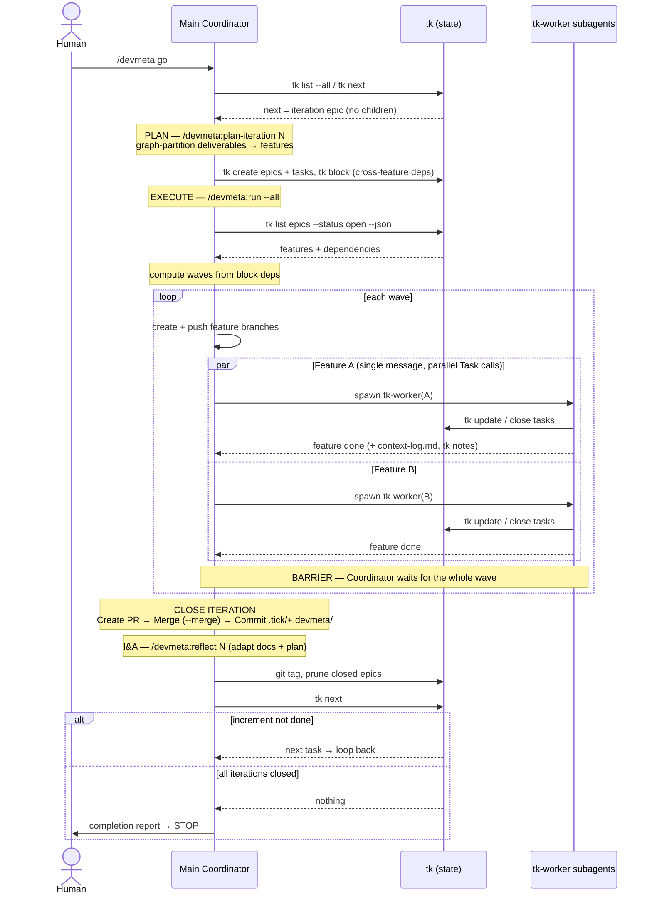
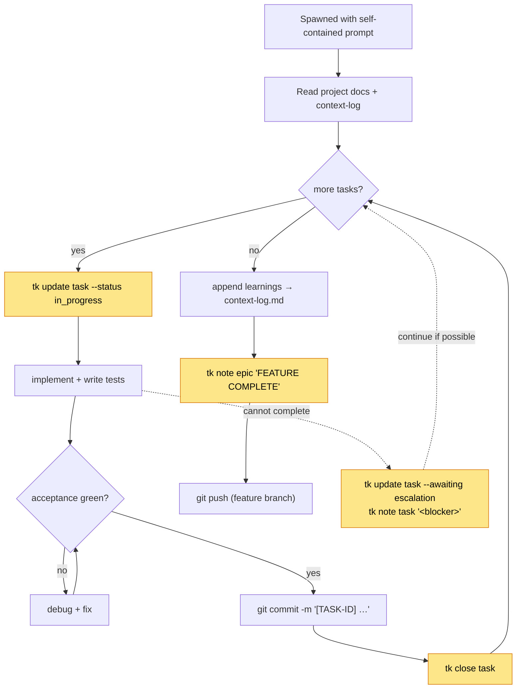
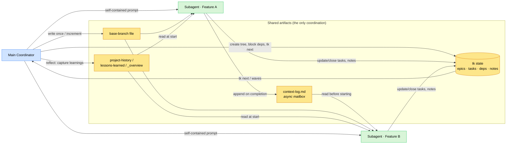

# DevMeta — Delegation Model

How work is decomposed and delegated across three systems: the **Main Coordinator**, **Subagents** (`tk-worker`), and **tk** (the tick tracker). This document is the reference for *who does what, where*.

---

## The three systems

| System | What it is | What it does | What it does NOT do |
|--------|-----------|--------------|---------------------|
| **Main Coordinator** | The single agent running `/devmeta:go` (and, within it, `/devmeta:plan-iteration`, `/devmeta:run`, `/devmeta:reflect`). | Assesses state, decomposes work into tk structure, schedules and spawns subagents, runs the I&A cycle, handles git/PR/merge at iteration boundaries. | Does **not** implement feature code in parallel — it delegates that to subagents. Does not invent next actions — it asks `tk`. |
| **Subagents** (`tk-worker`) | Short-lived workers, **one per feature**, each with its own ~200k-token context. | Implement all tasks of one feature in order: code, tests, commits, then push the feature branch. Communicate findings via `context-log.md` and `tk notes`. | Do **not** see each other. Do not pick their own work — they're handed an ordered task list. Do not cross feature boundaries (no shared files). |
| **tk** (tick tracker) | A passive CLI-backed state store. `epic` = Feature, `task` = Task. | Holds the entire work breakdown (iterations → features → tasks), dependencies, status, notes, acceptance criteria. Answers "what's next?" via `tk next`. **Single source of truth for project state.** | Does **nothing autonomously.** It records and serves state. It never spawns agents or runs code. Both coordinator and workers mutate it via CLI. |

**Mental model:** `tk` is the shared brain (state), the Coordinator is the nervous system (decisions + scheduling), subagents are the hands (parallel execution).

---

## Work decomposition hierarchy

Work is broken down top-down. Each level lives in a specific system. Node color shows *which system executes it*.

- **Grey** = human-defined (via `start-increment-spec`)
- **Blue** = executed by the **Main Coordinator**
- **Green** = executed by **Subagents** (`tk-worker`)
- Every node above is also a **tk** record (epic or task) — tk stores the whole tree regardless of who executes it.

| Level | Created by | Owned/executed by | Stored in |
|-------|-----------|-------------------|-----------|
| Increment | `start-increment-spec` (human dialogue) | — | `.devmeta/increments/increment-<NN>-<XXX>/_overview.md` |
| Iteration | Coordinator (bootstrap / planning) | Coordinator | tk top-level epic + `iterations/iteration-<N>/status.md` |
| Feature | Coordinator (`plan-iteration`) | **Subagent** (one per feature) | tk epic (parent = iteration) + feature spec in `.devmeta/projects/` |
| Task | Coordinator (`plan-iteration`) | Subagent (sequential, in order) | tk task (parent = feature) |
| Coordinator tasks (PR/merge/metadata/reflect) | Coordinator (`plan-iteration`) | **Coordinator itself** | tk task (parent = iteration) |

The single most important boundary decision — **where to cut features** — happens in `plan-iteration` via graph-partitioning on shared files, so that features in the same wave never touch the same files and can run truly in parallel.

---

## Who runs in which system, per command

| Command | Runs in | Delegates to subagents? | tk role |
|---------|---------|------------------------|---------|
| `/devmeta:start-increment-spec` | Coordinator (interactive) | No | none yet (writes `.devmeta/` files only) |
| `/devmeta:go` | Coordinator | Indirectly (calls `run`) | **Drives the loop** via `tk next` |
| `/devmeta:plan-iteration N` | Coordinator | No | **Writes** the feature/task tree + dependencies |
| `/devmeta:run [--all]` | Coordinator (thin scheduler) | **Yes — one per feature** | **Reads** deps to compute waves; workers update tasks |
| `/devmeta:reflect N` | Coordinator | No | Reads notes; tags, prunes closed epics |
| `/devmeta:status` | Coordinator | No | **Reads only** (never mutates) |

---

## The delegation flow (end-to-end)

The lifelines make explicit *what happens in which system*: the **Coordinator** decides and schedules, **tk** holds state and answers "what's next", **Subagents** execute features in parallel.

### What a subagent does (one feature)

Each worker is spawned with a **self-contained prompt** (no shared memory): feature description + ordered task list + acceptance, full per-task details (`tk show`), the current `context-log.md`, prior feature notes (`tk notes <epic>`), and its pre-created feature branch name. It first reads `CLAUDE.md`, `principles-and-choices.md`, `lessons-learned.md`, `context-log.md`, and `devmeta.md`, then runs this loop:

Yellow nodes are writes to **tk**; everything else happens inside the subagent's own context (code, tests, git, `context-log.md`).

---

## Communication channels (how systems exchange information)

Subagents are isolated — they cannot talk to each other or to the coordinator directly. All coordination is mediated through shared artifacts:

| Channel | Written by | Read by | Carries |
|---------|-----------|---------|---------|
| **tk state** (epics/tasks/status/deps) | Coordinator (structure) + workers (task status/notes) | Coordinator (`tk next`, waves), workers (their task list) | The authoritative "what exists / what's next / what's done" |
| **`tk notes`** | Workers (`tk note <epic>`), coordinator | Coordinator, reflect, next-run workers | Per-feature/-task narrative: completion, blockers, escalation |
| **`context-log.md`** (per feature group, in `.devmeta/projects/...`) | Workers (append on completion) | Later-wave workers, reflect | Patterns established, gotchas, decisions — the async "mailbox" between features |
| **`<increment-dir>/base-branch`** (plain text) | Coordinator (Phase 0.5, once per increment) | Coordinator + workers | Single source of truth for the branch to fork from, PR into, and run I&A on |
| **`status.md`** (per iteration) | Coordinator | Humans, status command | Human-readable iteration progress + feature independence map |
| **`.devmeta/` docs** (project-history, lessons-learned, `_overview.md`) | Coordinator (mostly in reflect) | Everyone, next iterations | Long-term learning + scope of record |
| **Worker prompt** | Coordinator | The one subagent | One-shot, self-contained handoff of everything a feature needs |

---

## How conflicts are prevented across parallel subagents

Subagents run concurrently with no live coordination, so safety is structural, established at planning time:

1. **Space (file) isolation** — `plan-iteration` guarantees *no file is modified by two independent features*. Shared code is extracted into a foundation feature that runs first.
2. **Time (dependency) isolation** — `run` computes **waves** from feature-level `block` deps. Dependent features land in different waves; the coordinator enforces a **barrier** (waits for the whole wave) before the next.
3. **Branch isolation** — each feature gets its own `feature/YYYY-MM-DD-<name>` branch off the recorded base branch, so commits never collide in the working tree.
4. **Async handoff** — anything a later feature needs to know is left in `context-log.md`, not passed live.

---

## What stays in the coordinator (never delegated)

These are done by the coordinator *itself* as ordinary tasks parented to the iteration — they're not subagent work:

- **PR creation for the iteration**, **merge** (always `--merge`, never squash/rebase), and **returning to base branch**.
- **Committing metadata** (`.tick/` and `.devmeta/`) to the base branch after merge — these files change during orchestration but aren't in the iteration PR (they live on the base branch, not the feature branches).
- **The I&A cycle** (`/devmeta:reflect N`) — code-quality review, outside-in gap verification, docs audit, git tag, pruning closed epics, project-history update, plan reassessment.
- **Planning the next iteration** — the last I&A task is *real planning work*, deliberately not a "continue?" handoff, so the loop never stalls at an iteration boundary.

> Note: PR creation is the coordinator's job — `go.md`'s iteration-level "Create PR for iteration N" task opens **one PR per iteration** (one per modified repo in multi-repo mode). Feature workers only commit and push their branch; they do not open PRs.

---

## The decision rule that ties it together

> **If `tk next` returns a task, do that task. Don't interpret markdown to decide what's next — the tick structure already encodes the answer.**

- `tk` holds the encoded plan.
- The **coordinator** reads it, fills in structure when a level is empty (plan an iteration, create I&A tasks), and delegates feature execution to **subagents**.
- **Subagents** push their results back into `tk` and `context-log.md`.
- The loop repeats until `tk next` returns nothing and all current-increment iterations are closed — the one true stopping point.
