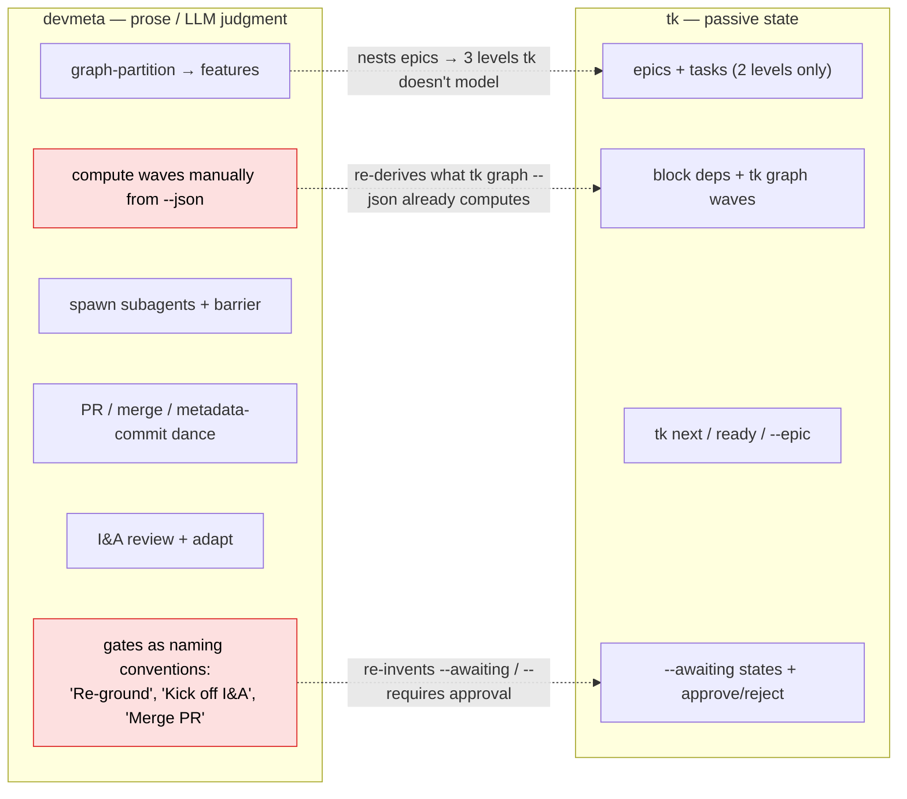
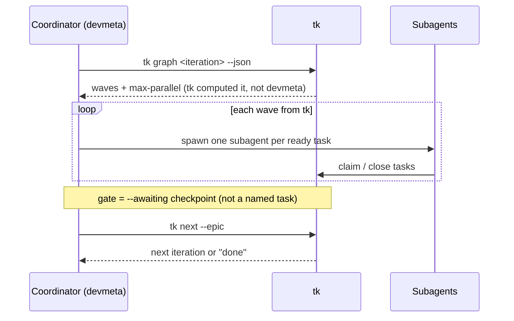
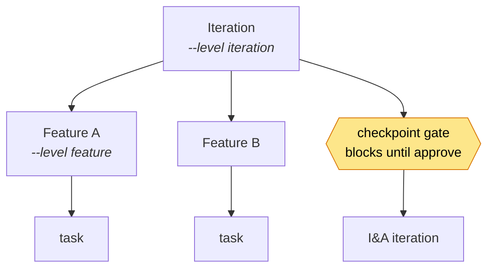
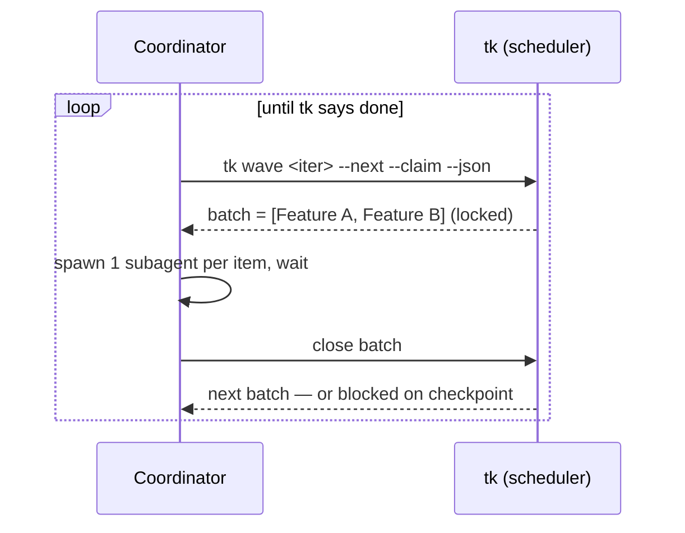
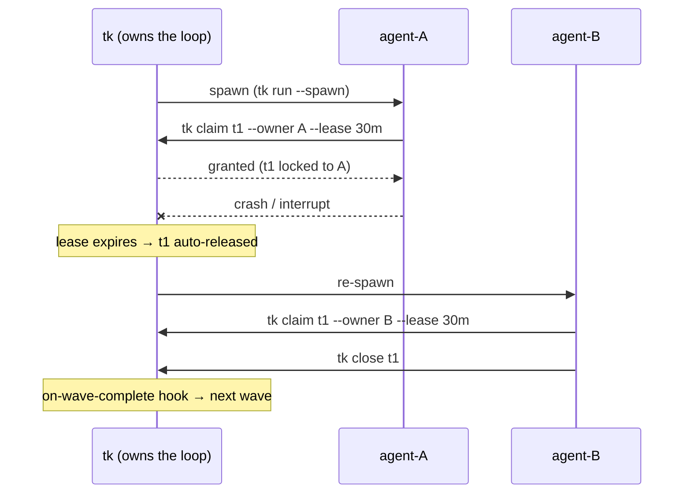
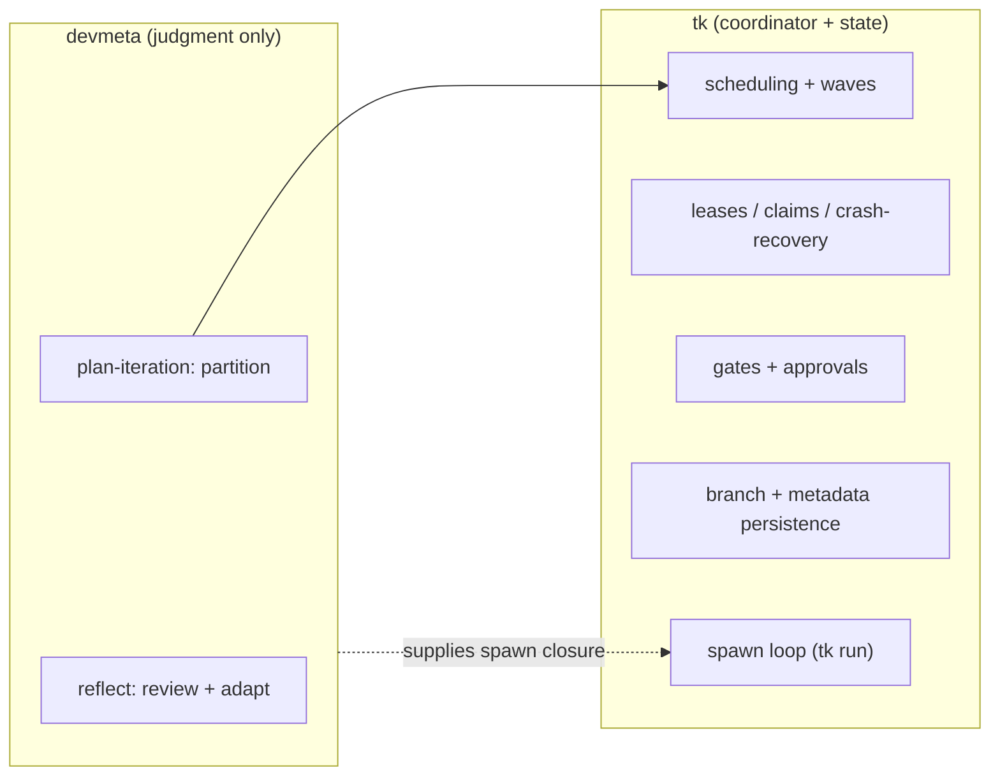

# DevMeta ↔ tk — Redrawing the Division of Work

Three proposals for a more efficient split of responsibility between **devmeta** (the orchestration prompts) and **tk / ticks** (the tick tracker), based on the current ticks feature set (`github.com/pengelbrecht/ticks`) and the devmeta command set.

> **tk in one line:** a state tracker + scheduler-*hints* provider — JSON files, no daemon. It deliberately does **not** run agents and explicitly disclaims "advanced multi-agent coordination hooks" as a beads-ism.

---

## Where the boundary sits today

The core finding: **devmeta re-implements in prose several things tk already does natively, and forces tk's 2-level model (epic→task) into a 3-level one (iteration→feature→task) it doesn't formally bless.**



### Friction inventory

| # | Friction | Today (devmeta) | tk capability that exists / is missing |
|---|----------|-----------------|-----------------------------------------|
| 1 | **Wave math duplicated** | `run.md` parses `tk list --json` + block deps and computes waves in prose | `tk graph <epic> --json` already emits waves + critical path + max-parallel |
| 2 | **Next-action branching** | `go.md` has a large "if `tk next` returns X…" tree | `tk next --epic`, `tk next <epic>`, `tk ready` already cover this |
| 3 | **Human gates are naming conventions** | "Kick off I&A", "Merge PR", escalation encoded as task titles | `--awaiting {checkpoint,review,escalation,…}`, `--requires approval`, `tk approve/reject` exist |
| 4 | **3-level vs 2-level mismatch** | iteration-epic → feature-epic → task (nested epics) | tk natively models epic→task only; nesting is unblessed |
| 5 | **Metadata-commit dance** | manual `git add .tick/ .devmeta/` after every merge | tk has no self-persist / commit hook |
| 6 | **Branch tracking outside tk** | `<increment-dir>/base-branch` plain-text file | no branch field on issues |

The three proposals are points on one axis: **how much deterministic mechanics to push down into tk.** devmeta always keeps the *judgment* (partitioning, code review, scope adaptation); the question is how much *bookkeeping* it stops doing.

---

## Proposal 1 — "Thin Coordinator" (use tk as-is; ~zero tk changes)

**Exec summary.** devmeta stops re-implementing tk's scheduler and gate logic in markdown and just *calls the commands tk already ships*. `run.md`'s hand-rolled wave computation → `tk graph <iteration-epic> --json`. `go.md`'s sprawling next-action tree → `tk next --epic` / `tk next <epic>` / `tk ready`. The naming-convention gates become native `--awaiting {checkpoint,review,escalation}` + `--requires approval` / `tk approve` / `tk reject`. Judgment work (partition, reflect, scope) stays in devmeta. Net: ~30% less prose, far fewer LLM-interpretation failure points, **no tk fork**.

**tk changes:** none (optionally just *document* the checkpoint-transition syntax — the state exists but its CLI transition isn't documented).



**Trade-off:** smallest win, smallest risk. Does *not* fix the 3-level mismatch (#4) or the metadata/branch friction (#5, #6) — those stay devmeta's problem.

---

## Proposal 2 — "Scheduler in tk" (moderate, additive tk changes) — **recommended target**

**Exec summary.** Make tk *structurally aware* of the iteration/feature/gate hierarchy devmeta currently enforces by convention, so the schedule becomes **data, not prose**. Add a typed level so iteration/feature/task is first-class (kills #4). Add `tk wave <epic> --next --claim --json` that hands devmeta *exactly the next runnable parallel batch* and atomically locks it — so `run.md` becomes a trivial loop instead of graph analysis. Make checkpoints real blocking gates that suspend descendant waves until `tk approve`. devmeta still **plans** and **reflects** but no longer computes, tracks, or gates waves.

**tk changes needed:**
- `--level iteration|feature|task` (or typed nesting) → blesses the 3-level tree.
- `tk wave <epic> --next --claim --json` → "give me the next parallel batch and lock it."
- `tk checkpoint <id>` → an enforced gate blocking later waves until approved (wires the existing `checkpoint` awaiting-state to real blocking behaviour).





**Trade-off:** tk does scheduling + gating; devmeta shrinks to planner + reflector + spawner. Moderate tk work, fully *additive* (keeps tk's "JSON files, no daemon" ethos). Best balance of effort vs. payoff.

---

## Proposal 3 — "tk as execution contract" (large, architectural tk changes)

**Exec summary.** Push the *entire run-loop coordination* into tk via a lease/claim protocol + lifecycle hooks — exactly the "advanced multi-agent coordination" tk currently disclaims. Each subagent gets an identity (`--owner agent-A`) and **leases** a task atomically (`tk claim --lease <ttl>`): double-pickup becomes impossible and a crashed/interrupted run self-heals when the lease expires (true resumability). A `tk run --spawn '<cmd>'` execution contract lets tk walk the ready frontier and invoke devmeta's spawn closure per task — *the loop lives in tk*; devmeta supplies only the spawn command + the plan. Branch/worktree association moves into tk fields (kills #6); a commit-hook persists tk's own `.tick/` metadata (kills #5). devmeta collapses to two judgment commands: `plan-iteration` and `reflect`.

**tk changes needed:**
- `tk claim <id> --owner <agent> --lease <ttl>` + auto-release on expiry (crash-safe leases).
- `tk run --spawn '<cmd>'` lifecycle contract + `on-wave-complete` / `on-task-done` hooks.
- Branch fields: per-feature `--branch`, per-epic base-branch (replaces the `base-branch` file).
- Optional commit hook so tk self-persists metadata.





**Trade-off:** biggest payoff (crash-safe, near-zero orchestration prose, branch + metadata friction gone) but it **couples tk to the agent runner** and contradicts tk's stated "intentional simplicity vs. beads." Justified only if devmeta is tk's primary consumer.

---

## Comparison

| | P1 Thin Coordinator | P2 Scheduler in tk | P3 Execution contract |
|---|---|---|---|
| tk changes | none | moderate, additive | large, architectural |
| Fixes wave duplication (#1) | ✅ | ✅ | ✅ |
| Fixes next-action branching (#2) | ✅ | ✅ | ✅ |
| Fixes gate conventions (#3) | ✅ | ✅ | ✅ |
| Fixes 3-level mismatch (#4) | ❌ | ✅ | ✅ |
| Fixes metadata/branch friction (#5,#6) | ❌ | ❌ | ✅ |
| Crash-safe / resumable | partial | partial | ✅ |
| Respects tk's "simple" ethos | ✅ | ✅ | ⚠️ breaks it |
| devmeta prose removed | ~30% | ~50% | ~75% |

**Recommendation: ship P1 now, target P2.** P1 is free and removes the most error-prone prose immediately (manual wave math + gate conventions are exactly where an LLM coordinator drifts). P2 is the right resting point — *mechanics to tk, judgment to devmeta* — and stays within tk's design philosophy. P3 is only justified if you want tk itself to become a general multi-agent runtime, a different product bet than "simple JSON tracker."

---

## Appendix — Concrete Proposal 1 edits (no tk changes)

### `run.md` — replace manual wave computation

**Phase 2 today** parses `tk list --type epic --status open --json`, reads each feature's cross-feature `blocked_by`, and builds the wave graph in prose. Replace with:

```bash
# tk already computes waves, critical path, and max-parallel:
tk graph <iteration-epic-id> --json
```

Then iterate the `waves[]` array tk returns; spawn one subagent per task in `waves[i]`. Delete the "Build feature-level dependency graph / Compute waves" prose entirely.

### `go.md` — lean on `tk next` variants

Phase 0 / Phase 2 keep the "if `tk next` returns a task → do it" rule but drop the hand-maintained branch list in favour of:

```bash
tk next --epic        # next iteration/epic to plan
tk next <iteration>   # next ready task within the active iteration
tk ready              # full ready frontier when spawning a wave
```

### Gates → native awaiting states

| Convention today | Replace with |
|------------------|--------------|
| "Kick off I&A Cycle NR" task | iteration epic `--awaiting checkpoint`; `tk approve` to release |
| "Create PR" + PR review | task `--awaiting review` |
| "Merge PR" needs human OK | `--requires approval` → `tk approve` / `tk reject "feedback"` |
| Worker stuck (already half-done) | `--awaiting escalation` (already used) — keep, make uniform |

### What stays in devmeta (do **not** push to tk)

- `plan-iteration` Step 3 graph-partitioning — genuine judgment.
- `reflect` code-quality + outside-in gap verification — genuine judgment.
- `start-increment-spec` interactive scoping — human dialogue.

Net deletion target: the wave-computation prose in `run.md` Phase 2 and the next-action enumeration in `go.md` Phase 2 — the two densest, most drift-prone blocks.
