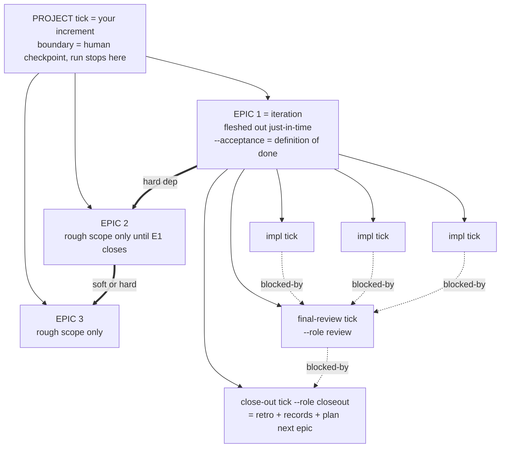
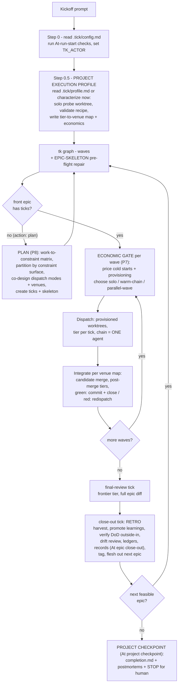
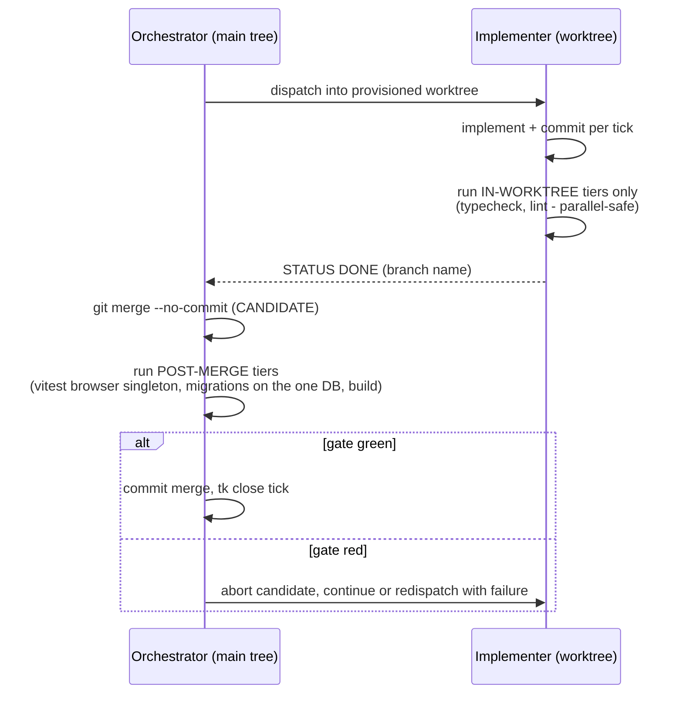
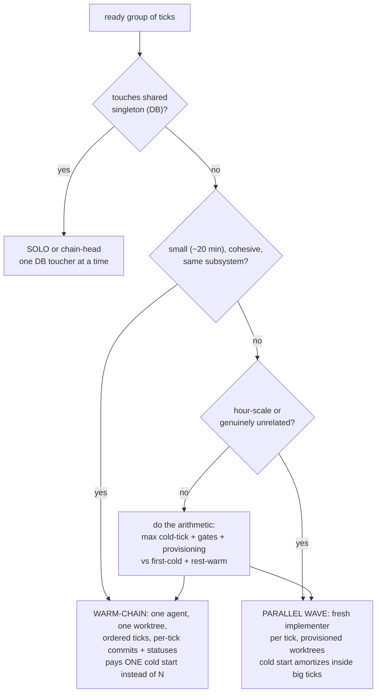
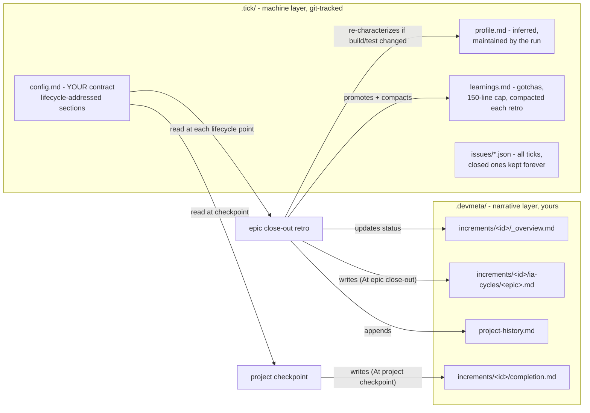
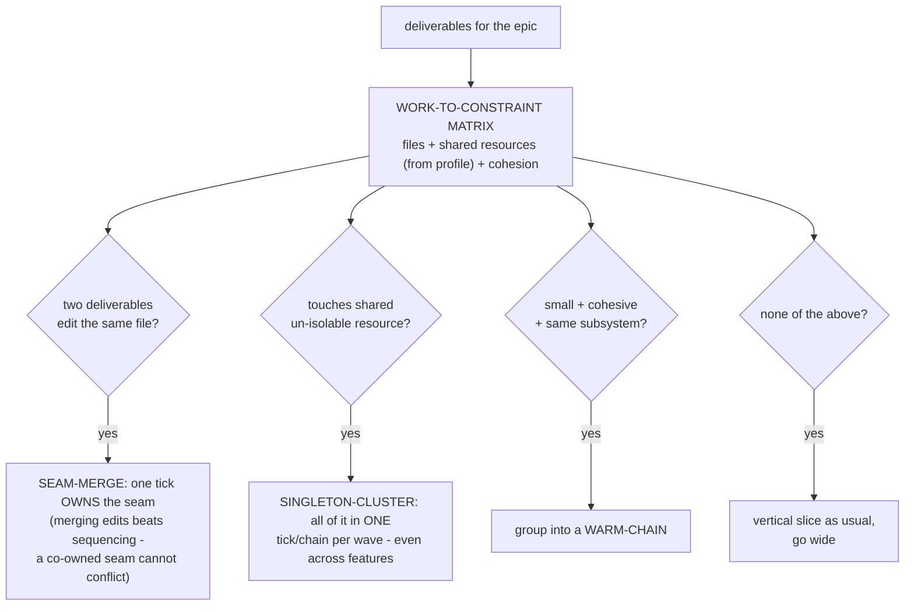
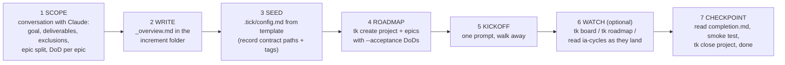

# The Synthesized Ticks Skill — A Personal Explainer

*For Morten, 2026-07-07. Covers the skill as it stands on `mkelk/ticks-melk@2026-07-05-synthesis`
(P3 lifecycle config + P6 execution readiness + P7 dispatch economics + P8 partitioning doctrine).
Validated across benchmark runs 2–4; full evidence in `2026-07-05-devmeta-ticks-synthesis.md`.*

---

## Part 1 — How the skill works now

### The mental model in one paragraph

You describe work as a small **roadmap in tk** (a project containing epics with definitions of
done). One kickoff prompt starts a run. The engine then *teaches itself the project* (test
commands, how to make worktrees runnable, which test tiers can run in parallel), *plans each
epic just-in-time* (partitioning by what actually constrains concurrency), *prices every
dispatch decision* (warm-chain vs parallel wave vs solo), *verifies where it's safe to verify*
(cheap tiers in worktrees, shared-resource tiers serially on merge candidates), and *writes the
records you care about* (retro reports, narrative history, tags) at every boundary — then stops
at the project checkpoint for you. Nothing asks you anything mid-run; everything it decides is
recorded with its arithmetic.

### The structure: what lives in tk



Key invariants:
- **EPIC-SKELETON**: every runnable epic ends with the review + close-out pair, created at
  planning time, machine-checked (`tk graph --json` reports `missing_process_ticks`).
- **Epics auto-continue** into each other; the **project boundary stops** for you.
- **The orchestrator owns all tk state**; implementers only ever write code.
- **Closed ticks are never pruned** — they're the machine half of your historical record.

### The run loop



### P6: the profile — the engine teaches itself the project

At step 0.5, with **zero hand-written config**, the orchestrator characterizes the repo and
writes `.tick/profile.md`:

- **Test commands** (inferred from package.json/Makefile/CI config)
- **Worktree provisioning recipe** — validated by a solo probe *before* wave 1 (in atomic-crm:
  junction `node_modules` from the main checkout, seconds per worktree, plus the discovered
  hazards: `--incremental false` for typecheck, never `rm -rf` a junction)
- **Tier → venue map** — where each test tier may run (below)
- **Dispatch economics** — measured warm/cold task-time ratio, provisioning costs

The profile is a *cache with maintenance*: re-derived when its inputs change (retro checks
whether the epic's diff touched build/test setup), with a **runtime tripwire** (flaky parallel
verifies → downgrade the tier immediately). Safety bias throughout: **a tier runs in parallel
only on positive evidence of isolation** — absence of evidence of sharing is not evidence of
isolation.

### P6: venues — where verification runs



The point: implementers verify what's safe in isolation; anything touching a **shared
singleton** (the one local Supabase on :54322, browser-mode vitest) is verified by the
orchestrator, serially, on merge candidates — green-before/red-after gives per-tick
attribution, and the integration branch is never left red. `DONE` from an implementer means
"in-worktree tiers pass," not "fully verified"; the close happens only after the candidate
gate.

### P7: the economic gate — three dispatch modes, priced



The numbers behind it (measured in the benchmarks): a **fresh implementer pays 20–35 min/tick**
largely re-reading the world; a **warm worker does comparable tasks in 4–9 min** (ratio ≈ ⅓–½,
recorded in the profile and updated from real data). Chains keep everything else intact:
per-tick commits (audit trail), per-tick statuses (a blocked chain stops at the completed
prefix), one candidate merge per chain. Disjoint chains run in parallel worktrees. Worktrees
can be **pooled** across ticks/waves (reset to integration commit between assignments).
Deliberate sequential is always legitimate — the rule is *never silently degrade*, not *always
parallelize*. Every choice lands in the retro's **dispatch-mode ledger** with its arithmetic.

### The records (P3): what gets written, where, when



`.tick/config.md` sections are **delivery addresses, not topics** — each is wired to exactly
one consumption point: `Testing` (implementers + wave gates), `At run start` (pre-flight),
`For implementers` (inlined in every prompt — keep lean), `At wave end`, `At epic close-out`,
`At project checkpoint`. Absent sections are no-ops. **This file is where your record contract
lives** — it's the whole reason the `.devmeta/` narrative tree keeps getting written without
any engine fork.

### Resume, crashes, monitoring

- **Resume = re-invoke the skill.** Every `tk next --json` maps to exactly one action
  (implement / plan / review / closeout / await). Stale `in_progress` ticks get reset;
  leftover worktree branches get reconciled; a dead chain resumes from its last committed tick.
- **Monitoring**: `tk roadmap` (epic-level), `tk graph <epic>` (waves), `tk board` (web
  kanban, live), plus the ia-cycle reports landing as each epic closes.

---

## Part 2 — What P8 changed

Before P8, planning clustered by **shared files only**, and "slice vertically" was the backbone
principle. Run 3 spontaneously did something better; P8 made it law.

### The doctrine: partition by constraint surface



Concretely, the four changes:

1. **Work-to-file matrix → work-to-constraint matrix.** Files *plus* shared un-isolable
   resources (from the profile) *plus* cold-start cohesion.
2. **Seams: merge, don't sequence.** When two deliverables edit the same file, prefer one tick
   that owns both edits over two sequenced ticks. This is what deleted run 2's only merge
   conflict: run 4's tick `mam` = "F3 status control **+** F4 export button on QuoteShow
   (UI seam)" — one tick, zero conflicts.
3. **Singletons: one toucher per wave, across feature lines.** "Never two DB-touching ticks in
   the same parallel wave" generalized to any post-merge-venue resource. Run 4's `w82` combined
   F3's triggers and F5's reporting view into one DB-foundation tick.
4. **Vertical slicing demoted** from backbone principle to *default within a constraint group*.
   Surfaces override feature taxonomy — grouping one wave's DB work "horizontally" across
   features is correct, not a violation.

Plus the meta-change: **partitioning, dispatch modes, and verify venues are one joint decision**
against the profile — the planner cuts the work already knowing how each group will run, rather
than partitioning first and pricing later.

What P8 did *not* change: tick semantics, the skeleton, the retro, integration mechanics — it
is pure planning doctrine (prose only). Honest footnote from the campaign: on current frontier
models about half of P8's value is that it *licenses* judgment the old vertical-slicing rule
suppressed; the procedural steps are compressible as models improve (see §14 of the synthesis
doc).

---

## Part 3 — Migrating your daily routine from devmeta

### The concept map

| Old devmeta | New synthesized ticks | Notes |
|---|---|---|
| Increment | **Project tick** | boundary = checkpoint, run stops for you |
| Iteration | **Epic** (with `--acceptance` = DoD) | auto-continues to next epic |
| Feature (worker unit) | **Warm-chain** (when the gate picks it) | the economy survived; the layer didn't |
| Task | Tick | unchanged, still tk |
| `/devmeta:go` | **One kickoff prompt** to the ticks skill | resume = re-invoke |
| `/devmeta:start-increment-spec` | **Scoping conversation + setup checklist** (below) | dialogue survives; command retired |
| I&A cycle (`/devmeta:reflect`) | **Final-review tick + close-out retro** | structural, can't be forgotten |
| `.devmeta/devmeta.md` | **`.tick/config.md`** (lifecycle sections) | your local-adaptation hook, relocated |
| `lessons-learned.md` | **`.tick/learnings.md`** (150-line cap) + **`.tick/profile.md`** | rules vs execution facts, both self-maintained |
| iteration `status.md` files | `tk roadmap` / `tk board` (live) + overview status line | live state stays in tk; no mirrored markdown |
| "Commit metadata" tasks | gone | orchestrator commits tick state as it goes |
| Pruning closed ticks | **never prune** | closed ticks = machine record |
| `_overview.md`, `ia-cycles/`, `project-history.md` | **kept, identical location** | written via the config contract |

### What you keep (your particular requirement)

The entire `.devmeta/` narrative tree survives, same paths, same spirit:

- `increments/increment-<NN>-<xxx>/_overview.md` — you still write it at increment start
- `increments/.../ia-cycles/<epic>.md` — one retro report per epic (richer now: includes
  dispatch-mode + review-depth ledgers)
- `project-history.md` — narrative entry per epic
- `increments/.../completion.md` — written at the checkpoint
- git tags per epic

None of this depends on a fork: it rides in `.tick/config.md`'s `At epic close-out` /
`At project checkpoint` sections, executed inside the standard close-out tick. If you drop the
config sections, you get stock ticks; your record system is exactly one file's worth of opt-in.

### Your new routine, end to end



**Step 1–2, scoping (the part you liked from devmeta — keep doing it).** Have the
`start-increment-spec`-style dialogue in any session: goal, on-screen/under-the-hood
deliverables, exclusions, 2–5 epic split, and — the one thing to be disciplined about —
a **goal-compatible definition of done per epic** (checkable, bounded, outside-in), because
DoDs are what make the run safe to walk away from. Write `_overview.md` as always.

**Step 3, config (once per project, tweak per increment).** Copy the template below; per
increment you only change the increment path and tag prefix.

**Step 4, roadmap (two minutes).**

```bash
P=$(tk create "<Increment title>" -d "<goal + pointer to overview>" --target-date YYYY-MM-DD)
E1=$(tk create "<Epic 1>" -t epic --parent $P -d "<rough scope>" --acceptance "<DoD>")
E2=$(tk create "<Epic 2>" -t epic --parent $P --blocked-by $E1 -d "<rough scope>" --acceptance "<DoD>")
# only the FRONT epic gets detailed by the run; downstream stay rough — cheap to rescope
```

**Step 5, kickoff (the whole "go").**

> Run the "<Increment title>" roadmap with the ticks skill. Base branch `<branch>`. Follow the
> skill's loop exactly — step 0.5 (project execution profile), worktree provisioning,
> constraint-surface partitioning, and per-wave dispatch-mode selection via the economic gate.
> Honor `.tick/config.md`'s lifecycle sections. Stop at the project checkpoint.

**Step 6, while it runs.** Nothing is required of you. If you want to watch: `tk board`.
If it stalls or the session dies: re-invoke the skill on the branch — state recovers from
tk + git. (Across four synthesized runs: zero mid-run questions, zero interventions needed.)

**Step 7, at the checkpoint.** Read `completion.md` (gates status + postmortems), run the
manual smoke test, decide any flagged human items, `tk close <project-id>`, and start thinking
about the next increment. The next increment = repeat from step 1; **increment selection stays
a human call**, exactly as in devmeta.

### `.tick/config.md` template (your standing record contract)

```markdown
# Runner config — <project>

## For implementers
- Source of truth: <spec/brief path>. Do not add scope beyond it.
- Follow CLAUDE.md / AGENTS.md and existing code patterns.

## At epic close-out
1. Write the full epic-close retro report to
   `.devmeta/increments/<increment-id>/ia-cycles/<epic-title>.md`
   (one-line summary as the tk close --reason). Include the dispatch-mode
   and review-depth ledgers.
2. Append a narrative entry to `.devmeta/project-history.md`.
3. Update `.devmeta/increments/<increment-id>/_overview.md` (mark epic DONE).
4. Living-docs audit: fix any doc the epic proved wrong.
5. Tag: `git tag <project-tag>-<epic-slug> -m "<summary>"`.

## At project checkpoint
1. Write the increment completion report to
   `.devmeta/increments/<increment-id>/completion.md`
   (features, gates status, outstanding human items, postmortems).
2. STOP for human review.
```

*(No `Testing` / `At run start` sections needed — the profile infers them. Add them only to
override something the repo can't reveal, e.g. an out-of-repo staging resource.)*

### Habits to consciously drop

- Don't run planning/execution/reflection as separate commands — boundaries are ticks now;
  pre-empting them breaks nothing but wastes your time.
- Don't create iteration `status.md` mirrors — that's duplicated live state, the one devmeta
  habit the synthesis deliberately killed; `tk` is the live view.
- Don't prune closed ticks at reflection time.
- Don't hand-write test commands into config out of habit — let the profile earn its keep; it
  found things your hand-config never knew (the tsBuildInfo leak, the junction hazard).

### If you miss the interactive command

The scoping dialogue + steps 2–4 could be ported into a small `/increment:start` command (the
P1′ overlay idea — a thin wrapper that interviews you, writes the overview, seeds config, and
creates the roadmap). It's an hour of work if the manual checklist ever feels like friction;
so far it's three copy-pastes per increment.
